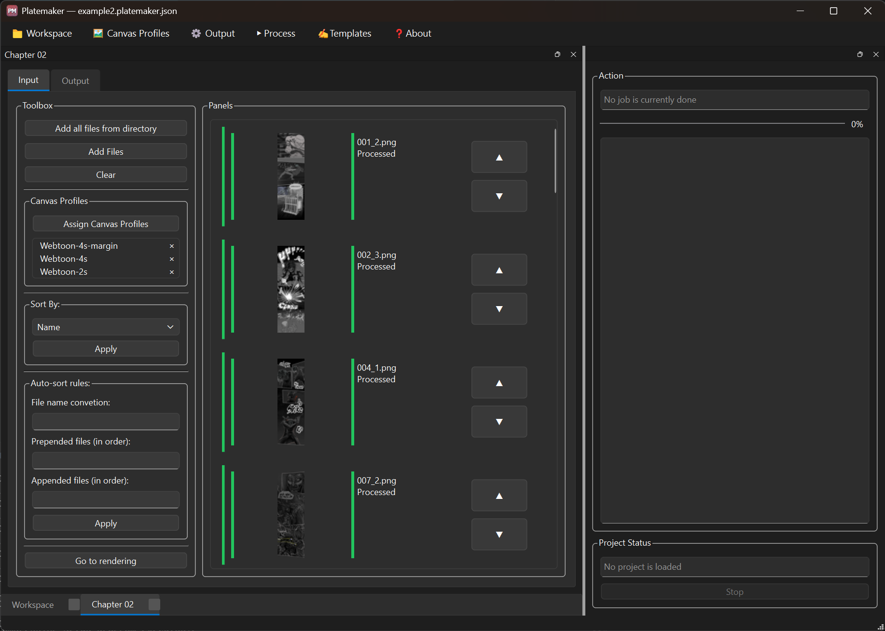
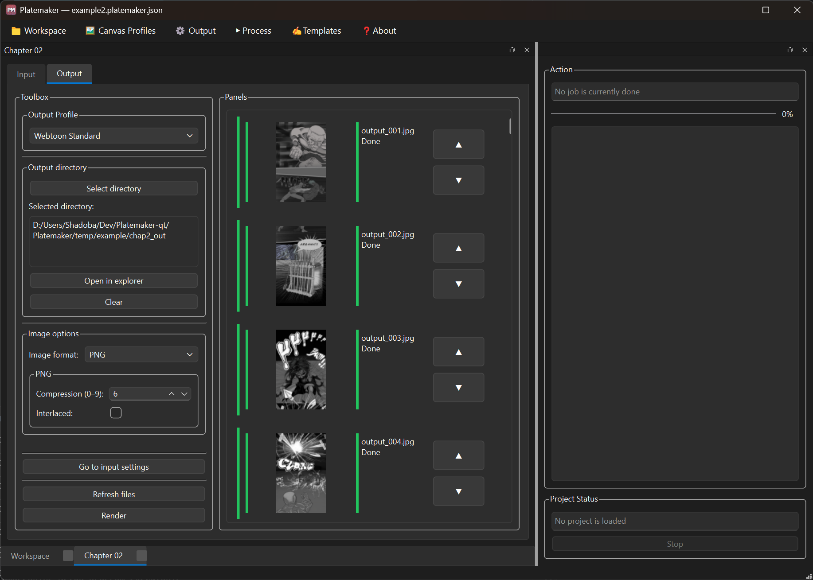
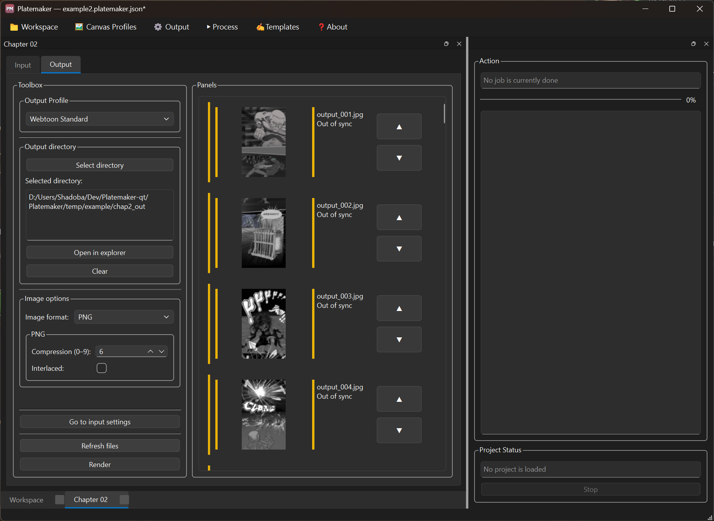
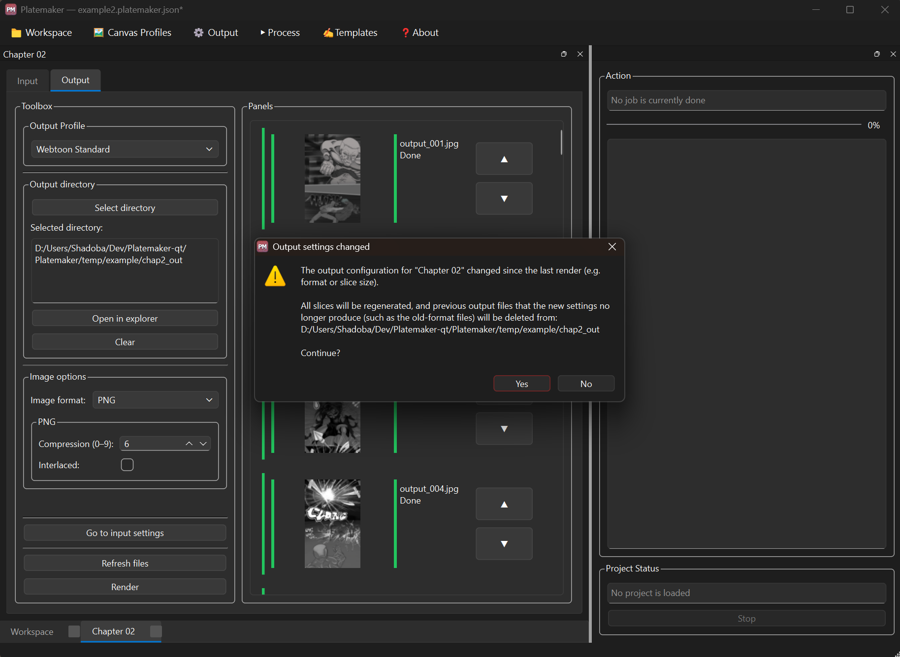
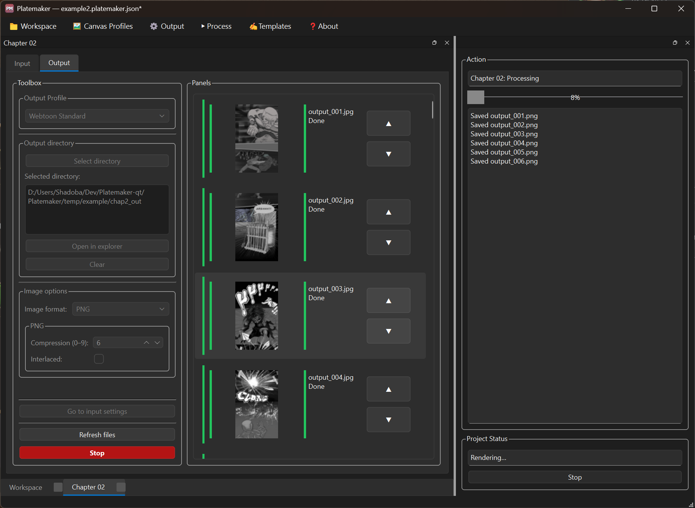

# Platemaker GUI

Qt 6 desktop frontend for [libplatemaker](https://github.com/ShadobaDev/PlateMaker) — a comic artist tool for pre- and post-processing Webtoon-format artwork.

> **Library documentation:** See the `PlateMaker` repository for the domain specification,
> data models, CLI reference, and pipeline details.

---

## Screenshots

_Project view — input files_



_Project view — output settings_



_Project view — output out of sync_



_Project view — output out of sync, warning before render_ 



_Project view — processing in progress_



_Canvas profile dialog_


_Canvas profile with margin guides_


_Template manager_


---

## Requirements

| Tool | Version | Notes |
|---|---|---|
| Qt | 6.5+ | Widgets module required |
| CMake | 3.21+ | Presets format v6 |
| MSVC 2022 or MinGW (MSYS2) | — | Windows |
| GCC / Clang | — | Linux |
| libplatemaker | 0.1.x | See **Linking libplatemaker** below |

---

## Building

The project is built and run from **Qt Creator**.  Open `CMakeLists.txt` as a
Qt Creator project and configure the kit (MSVC 2022 or MinGW 64-bit).

```bash
cmake -B .\build\Desktop_Qt_6_11_1_MinGW_64_bit-Debug\ -S .      
cmake --build .\build\Desktop_Qt_6_11_1_MinGW_64_bit-Debug\ --target installer
```
### Linking libplatemaker

`CMakeLists.txt` resolves `libplatemaker` in three steps, in order:

1. **`LIBPLATEMAKER_DIR` cache variable** (preferred during development)
2. System `find_package` / `CMAKE_PREFIX_PATH`
3. Automatic download from GitHub Releases (v0.1.1)

**Setting `LIBPLATEMAKER_DIR` in Qt Creator:**

1. Open **Projects** (left sidebar) → select your kit → **CMake** tab
2. Click **Add** → **String**
3. Name: `LIBPLATEMAKER_DIR`  
   Value: path to the dev package, e.g.
   ```
   D:/Users/Shadoba/Dev/PlateMaker/install/windows-msvc
   ```
4. Click **Apply Configuration Changes** → **Build**

The value is cached in `build/.../CMakeCache.txt` and survives reconfigures.

**Building the dev package from source:**

```powershell
# In the PlateMaker repository
cmake --preset windows-msvc
cmake --build --preset windows-msvc
cmake --install build/windows-msvc --config Release
# → install/windows-msvc/  (use this path as LIBPLATEMAKER_DIR)
```

### Windows: runtime DLLs

The CMake post-build step automatically copies `platemaker.dll` and all libvips
runtime DLLs next to the executable.  No manual PATH configuration is needed to
run from Qt Creator or the build directory.

---

## Development Workflow

### Branching

```
main          — stable, matches latest release tag
dev           — active development (default target for feature branches)
feature/<name>
fix/<name>
```

### Modifying UI files

UI forms (`.ui`) are edited in **Qt Designer** launched from within Qt Creator.  
Do **not** edit `.ui` XML files by hand — Qt Creator regenerates the `ui_*.h`
headers from them at build time and hand edits will be overwritten.

When adding a new widget to a dialog or window:
1. Open the `.ui` file in Qt Designer inside Qt Creator.
2. Drag and drop the widget.
3. Set the object name and properties.
4. Build — Qt will regenerate the header.
5. Reference the new widget via `ui->objectName` in the `.cpp`.

### Keeping in sync with libplatemaker

When libplatemaker changes its public API (new model fields, renamed methods):

1. Update `LIBPLATEMAKER_DIR` to point to the freshly installed dev package.
2. Click **Apply Configuration Changes** in Qt Creator.
3. Rebuild — the compiler will surface any API breaks immediately.

---

## Project Structure

```
Platemaker/
├── CMakeLists.txt
├── Platemaker.iss                 — Inno Setup installer script
├── app.rc                         — Windows app manifest / icon binding
├── app/
│   └── main.cpp
├── mainwindow/                    — application shell (MDI + docks)
│   ├── mainwindow.h / .cpp
│   ├── workspace.cpp
│   ├── projects.cpp
│   ├── render.cpp
│   ├── profiles.cpp
│   └── templates.cpp
├── widgets/
│   ├── project/                   — per-chapter image tile grid
│   │   ├── project.h / .cpp
│   │   ├── input.cpp
│   │   └── output.cpp
│   ├── imagetile/                 — single source image card
│   ├── canvasprofiledialog/
│   ├── managecanvasprofilesdialog/
│   ├── manageoutputprofilesdialog/
│   ├── outputprofiledialog/
│   ├── outputformatoptionswidget/
│   ├── renderworker/
│   └── templatesdialog/
│                                    (each folder holds its own .cpp/.h/.ui together)
├── icons/                         — .ico + source .png files (16–256 px)
└── docs/
    ├── SPECIFICATION.md           — GUI feature specification
    └── TODO.md                    — implementation checklist
```

---

## Licence

`Platemaker` is distributed under the **GNU General Public License v3.0** (GPL-3.0). See `LICENSE`.

Third-party components:
- **Qt 6** — LGPL 3.0 ([qt.io/licensing](https://www.qt.io/licensing/)), dynamically linked
- **libplatemaker** — LGPL 3.0-or-later, dynamically linked
- **libvips** — LGPL 2.1-or-later ([libvips.org](https://www.libvips.org/)), dynamically
  linked via libplatemaker; its own dependency DLLs ship alongside it on Windows
- **nlohmann/json** — MIT, header-only (compiled into libplatemaker, not linked separately)

---

## Contributing

Contributions are welcome. By opening a pull request you agree to the **[Contributor License Agreement](CLA.md)**.
