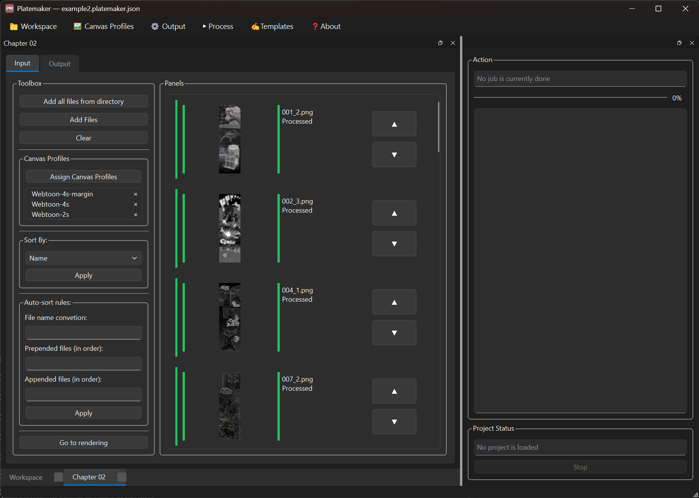
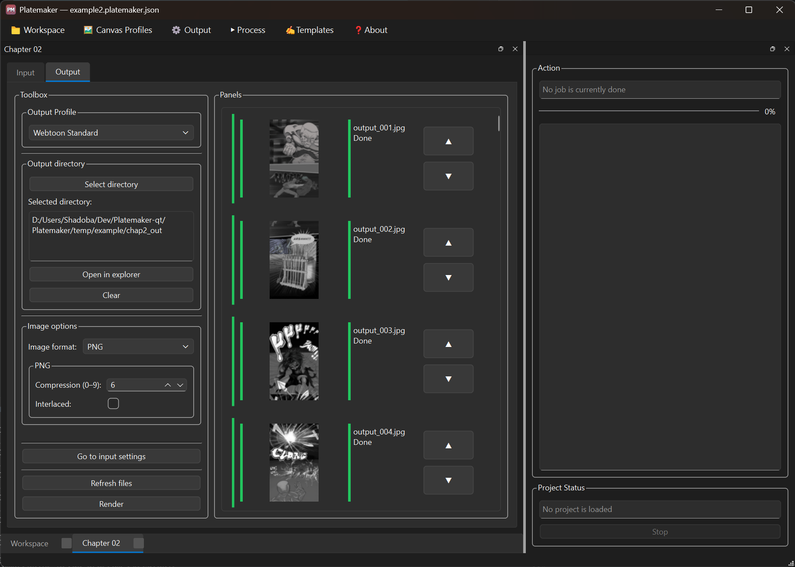
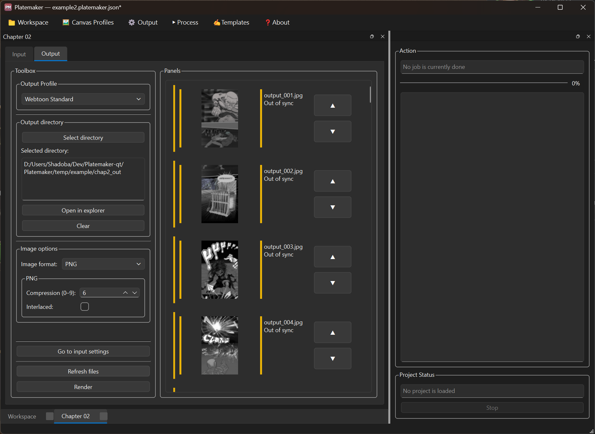
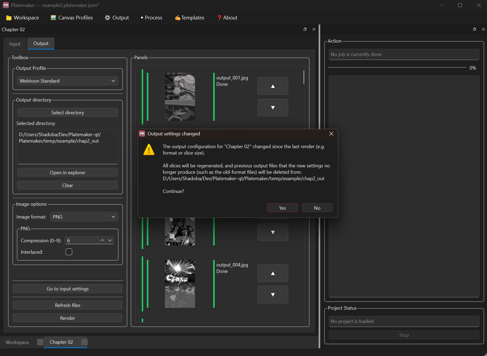
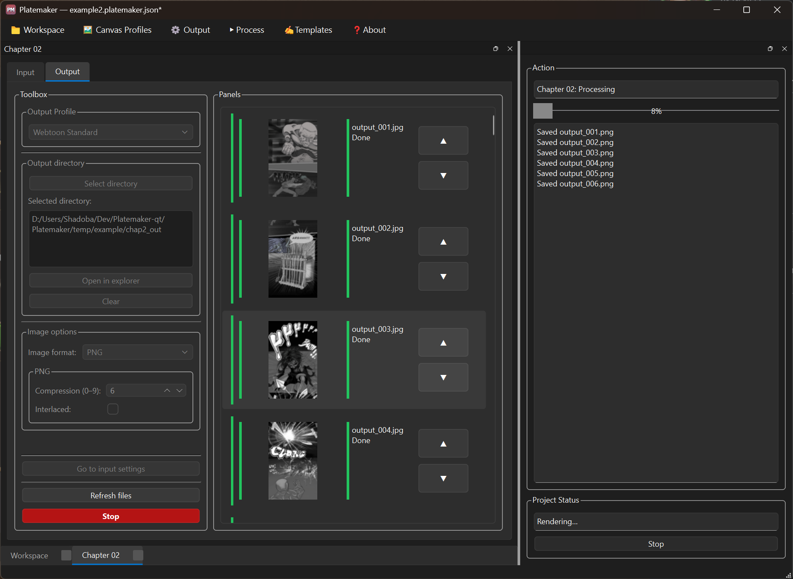

# Platemaker GUI

Qt 6 desktop frontend for [libplatemaker](https://github.com/ShadobaDev/PlateMaker) — a comic artist tool for pre- and post-processing Webtoon-format artwork.

> **Library documentation:** See the `PlateMaker` repository for the domain specification,
> data models, CLI reference, and pipeline details.

---

## Screenshots

_Project view — input files_



_Project view — output settings_



_Project view — output out of sync_



_Project view — output out of sync, warning before render_ 



_Project view — processing in progress_



_Canvas profile dialog_


_Canvas profile with margin guides_


_Template manager_


---

## Installing & verifying your download

The Windows installer is **not code-signed** — a paid certificate is required to remove Windows'
warning, and this is a free open-source project. SmartScreen may therefore show *"Windows protected
your PC / unknown publisher"*. That is expected for an unsigned installer, **not** a sign the file is
unsafe. To proceed: **More info → Run anyway**, or right-click the downloaded file →
**Properties → Unblock → OK** before running.

Since it isn't signed, you can verify the download yourself:

**1. Checksum (SHA-256)** — confirm the file is byte-for-byte what was published:

```powershell
Get-FileHash .\Platemaker-1.3.0-Setup.exe -Algorithm SHA256
```

**2. Provenance — proof GitHub itself built it from this repo.** Every release carries a GitHub
**build-provenance attestation**: GitHub vouches that the file was produced by this repository's release
workflow and records the exact source commit it was built from. This is stronger than a checksum — you
don't have to trust a hash *we* published.

- **In your browser (nothing to install):** open the
  [Attestations](https://github.com/ShadobaDev/Platemaker-qt/attestations) page. Each entry is a
  GitHub-verified build showing the file it covers (name + SHA-256), the **source commit**, and the
  **workflow** that produced it — i.e. GitHub confirming *"this binary was built here, from this commit."*
  Compare that SHA-256 with your download's (step 1): if they match, the attestation is about your file.
- **Command line ([GitHub CLI](https://cli.github.com/)) — one check for integrity + origin:**

  ```powershell
  gh attestation verify .\Platemaker-<version>-Setup.exe --repo ShadobaDev/Platemaker-qt
  ```

  A `✓ Verification succeeded!` confirms the file's digest matches and that it was built by this repo's
  `release.yml`.

**3. Malware scan** — the installer is scanned on VirusTotal.

### Latest verified build (1.3.0)

- **File:** `Platemaker-1.3.0-Setup.exe`
- **SHA-256:** `6d1b95c6dc68d94c9d7a8b4ea7a7c41f2135538d3ea4ab1bade091551cae7602`
- **VirusTotal:** [0 / 68 — clean](https://www.virustotal.com/gui/file/6d1b95c6dc68d94c9d7a8b4ea7a7c41f2135538d3ea4ab1bade091551cae7602)

> Each release has its own hash and scan; the values above are for 1.3.0. For newer builds, use the
> checksum and scan link published on that release's
> [Releases](https://github.com/ShadobaDev/Platemaker-qt/releases) page.

---

## Requirements

| Tool | Version | Notes |
|---|---|---|
| Qt | 6.8+ | Widgets module and setColorScheme required |
| CMake | 3.25+ | Presets format v6 |
| MSVC 2022 or MinGW (MSYS2) | — | Windows |
| GCC / Clang | — | Linux |
| libplatemaker | `LIBPLATEMAKER_VERSION` in `CMakeLists.txt` | See **Linking libplatemaker** below |

---

## Building

The project is built and run from **Qt Creator**.  Open `CMakeLists.txt` as a
Qt Creator project and configure the kit (MSVC 2022 or MinGW 64-bit).

```bash
cmake -B .\build\Desktop_Qt_6_11_1_MinGW_64_bit-Debug\ -S .      
cmake --build .\build\Desktop_Qt_6_11_1_MinGW_64_bit-Debug\ --target installer
```
### Linking libplatemaker

`CMakeLists.txt` resolves `libplatemaker` in three steps, in order:

1. **`LIBPLATEMAKER_DIR` cache variable** (preferred during development)
2. System `find_package` / `CMAKE_PREFIX_PATH`
3. Automatic download from GitHub Releases (version pinned by `LIBPLATEMAKER_VERSION`
   in `CMakeLists.txt` — the one place the required version is stated)

**Setting `LIBPLATEMAKER_DIR` in Qt Creator:**

1. Open **Projects** (left sidebar) → select your kit → **CMake** tab
2. Click **Add** → **String**
3. Name: `LIBPLATEMAKER_DIR`  
   Value: path to the dev package, e.g.
   ```
   D:/Users/Shadoba/Dev/PlateMaker/install/msvc-release
   ```
4. Click **Apply Configuration Changes** → **Build**

The value is cached in `build/.../CMakeCache.txt` and survives reconfigures.

**Building the dev package from source:**

```powershell
# In the PlateMaker repository
cmake --preset msvc-release
cmake --build --preset msvc-release
cmake --install build/msvc-release --config Release
# → install/msvc-release/  (use this path as LIBPLATEMAKER_DIR)
```

### Windows: runtime DLLs

The CMake post-build step automatically copies `platemaker.dll` and all libvips
runtime DLLs next to the executable.  No manual PATH configuration is needed to
run from Qt Creator or the build directory.

---

## Development Workflow

### Branching

```
main          — development; every release is a tag on it
feature/<name> — short-lived, merged into main
fix/<name>
```

### Modifying UI files

UI forms (`.ui`) are edited in **Qt Designer** launched from within Qt Creator.  
Do **not** edit `.ui` XML files by hand — Qt Creator regenerates the `ui_*.h`
headers from them at build time and hand edits will be overwritten.

When adding a new widget to a dialog or window:
1. Open the `.ui` file in Qt Designer inside Qt Creator.
2. Drag and drop the widget.
3. Set the object name and properties.
4. Build — Qt will regenerate the header.
5. Reference the new widget via `ui->objectName` in the `.cpp`.

### Keeping in sync with libplatemaker

When libplatemaker changes its public API (new model fields, renamed methods):

1. Update `LIBPLATEMAKER_DIR` to point to the freshly installed dev package.
2. Click **Apply Configuration Changes** in Qt Creator.
3. Rebuild — the compiler will surface any API breaks immediately.

---

## Project Structure

```
Platemaker/
├── CMakeLists.txt
├── Platemaker.iss                 — Inno Setup installer script
├── app/                           — main.cpp, resources.qrc, app.rc (manifest, icon, version)
├── mainwindow/                    — the application shell, one .cpp per concern
│                                    (workspace, projects, render, profiles, templates,
│                                     fonts, package, advisories, about)
├── widgets/                       — one folder per widget, its .cpp/.hpp/.ui together
│   ├── project/                   — a chapter: inputs, outputs and its undo history
│   ├── stripeditor/               — the strip editor (see docs/SPECIFICATION.md)
│   │   ├── (root)                 — the editor shell, objects, the object controller,
│   │   │                            the tool registry, page memory
│   │   ├── panels/                — tool options, object and strip state, grade
│   │   └── properties/            — one editor per property group
│   ├── artifact/                  — what a balloon is, how it is drawn, how it is saved
│   ├── workspacefolder/           — the workspace folder: lock, fonts, layout
│   ├── renderworker/              — the background render
│   ├── advisories/, badge/, …     — shared widgets
│   └── …dialog/                   — the profile, template and about dialogs
├── tests/gui-unit-tests/          — GoogleTest, the property model (PLATEMAKER_GUI_BUILD_TESTS)
├── icons/                         — app icons; tools/ and menu/ hold the SVG glyphs
├── cmake/, scripts/               — installer and portable-package builds
├── sbom/                          — the dependency manifest
└── docs/
    ├── SPECIFICATION.md           — what the GUI does, as it is now
    ├── CHANGELOG.md               — release to release
    └── TODO.md                    — the roadmap
```

---

## Licence

`Platemaker` is distributed under the **GNU General Public License v3.0** (GPL-3.0). See `LICENSE`.

Third-party components:
- **Qt 6** — LGPL 3.0 ([qt.io/licensing](https://www.qt.io/licensing/)), dynamically linked
- **libplatemaker** — LGPL 3.0-or-later, dynamically linked
- **libvips** — LGPL 2.1-or-later ([libvips.org](https://www.libvips.org/)), dynamically
  linked via libplatemaker; its own dependency DLLs ship alongside it on Windows
- **nlohmann/json** — MIT, header-only (compiled into libplatemaker, not linked separately)

Platemaker is distributed under open-source licences only — there is no commercial or
dual-licensed edition (see [CLA §7](CLA.md#7-current-licensing-status)).

---

## Download integrity & code signing

Every release publishes SHA-256 checksums and a GitHub build-provenance attestation, so you
can verify that an installer really came from this repository. How to check a download — and
how signing is handled — is documented in the **[code signing policy](docs/CODE-SIGNING-POLICY.md)**.

If your antivirus flags the installer, read that page first: unsigned binaries from small
projects are routinely flagged by ML heuristics without anything actually being detected.

---

## Contributing

Contributions are welcome — open an issue first for anything significant. To extend the strip editor, start with **[*Extending the strip editor*](docs/SPECIFICATION.md#extending-the-strip-editor)**; the wiki's [Development](https://github.com/ShadobaDev/Platemaker-qt/wiki/Development) pages explain how the rest is put together. By opening a pull request you agree to the **[Contributor License Agreement](CLA.md)**
and the **[Code of Conduct](CODE_OF_CONDUCT.md)**.
